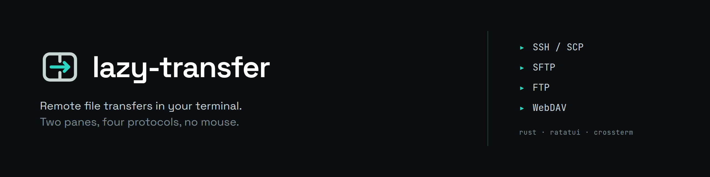
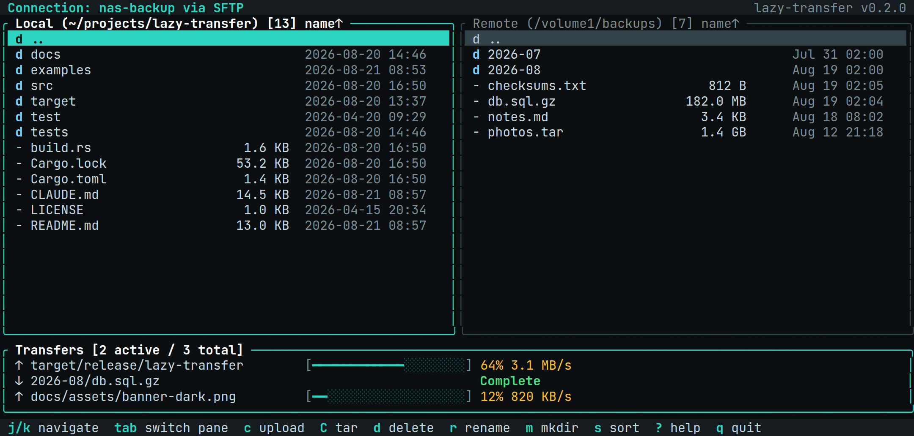
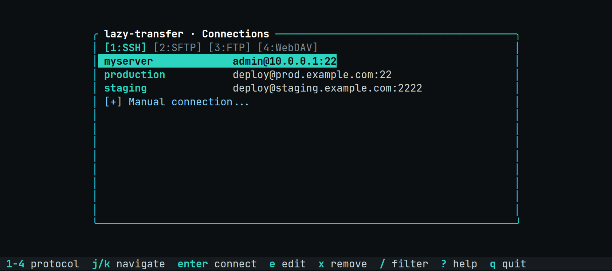

<p align="center">
  <picture>
    <source media="(prefers-color-scheme: dark)" srcset="docs/assets/banner-dark.png">
    <source media="(prefers-color-scheme: light)" srcset="docs/assets/banner-light.png">
    
  </picture>
</p>

<p align="center">
  <a href="https://github.com/RomainMILLAN/lazy-transfer/actions/workflows/ci.yml"></a>
  <a href="https://github.com/RomainMILLAN/lazy-transfer/releases"></a>
  <a href="https://www.rust-lang.org"></a>
  <a href="LICENSE"></a>
</p>

<p align="center">
  A dual-pane file manager for your terminal, over SSH/SCP, SFTP, FTP and WebDAV.<br>
  Built with <a href="https://ratatui.rs">ratatui</a> + <a href="https://github.com/crossterm-rs/crossterm">crossterm</a>, in the spirit of <a href="https://github.com/jesseduffield/lazygit">lazygit</a>.
</p>

<p align="center">
  <picture>
    <source media="(prefers-color-scheme: dark)" srcset="docs/assets/screenshot-browser-dark.png">
    <source media="(prefers-color-scheme: light)" srcset="docs/assets/screenshot-browser-light.png">
    
  </picture>
</p>

<p align="center">
  <sub><strong>Beta.</strong> Under active development — expect rough edges and breaking changes.</sub>
</p>

## Features

| | SSH/SCP | SFTP | FTP | WebDAV |
|---|:---:|:---:|:---:|:---:|
| Browse, upload, download | ● | ● | ● | ● |
| mkdir, delete, rename | ● | ● | ● | ● |
| Recursive directory transfers | ● (tar) | ● | ● | ● |
| Streams without buffering in RAM | ● | ● | | ● |
| Concurrent transfers | ● | | | ● |
| Reads `~/.ssh/config` | ● | | | |

- **Dual-pane navigation** — local and remote side by side, `tab` to switch
- **Progress tracking** — live progress bars, a transfer queue you can cancel
- **Inline search** — `/` fuzzy-filters any list; no modal dialog
- **Light/dark theme** — auto-detected from the terminal, `Ctrl+L` to toggle
- **Saved connections** — stored in `~/.config/lazy-transfer/connections.json`, mode `0600`
- **Non-blocking** — every transfer runs on a background thread, so the UI never freezes

Per-protocol notes:

- **SSH/SCP** — shells out to `ssh`/`scp` with `ControlMaster`, so a session is reused across commands. Directories go over as a tar stream.
- **SFTP** — native, via `libssh2`. Keeps one session open, which SFTP-only servers require.
- **FTP** — for legacy servers. Directory transfers walk recursively, since there is no tar to lean on. Downloads are read into memory before being written out, so a very large file needs the RAM to match.
- **WebDAV** — Nextcloud/ownCloud, Synology, Apache `mod_dav` and SabreDAV hosts (BigCommerce), over HTTP or HTTPS, with Basic, Digest, Bearer or anonymous auth. Self-signed certificates are refused once, then accepted per connection if you opt in. Its HTTP client needs no lock, so several transfers really do run at once.

## Prerequisites

The published binaries need nothing at all — libssh2 and OpenSSL are compiled
into them. This section is only for building from source.

- Rust 1.94 or newer
- OpenSSL development headers and `pkg-config` (libssh2 itself is always vendored
  by the `libssh2-sys` crate, so there is no `libssh2-dev` to install)

```bash
# Ubuntu/Debian
sudo apt install pkg-config libssl-dev

# Fedora/RHEL
sudo dnf install pkg-config openssl-devel

# macOS (Homebrew)
brew install pkg-config openssl@3
```

Or skip all of it and vendor OpenSSL too:

```bash
cargo build --release --features vendored-openssl
```

## Installation

### From GitHub releases (recommended)

Pre-built binaries are available on the [releases page](https://github.com/RomainMILLAN/lazy-transfer/releases).

Available assets: `lazy-transfer-linux-x86_64`, `lazy-transfer-linux-aarch64`,
`lazy-transfer-macos-x86_64`, `lazy-transfer-macos-aarch64`. Each archive holds the
binary and the licence; every release also publishes a `SHA256SUMS` file.

Quick — one line, nothing left behind:

```bash
# Adjust the asset name to your platform
curl -L https://github.com/RomainMILLAN/lazy-transfer/releases/latest/download/lazy-transfer-linux-x86_64.tar.gz \
  | tar -xz lazy-transfer
mv lazy-transfer ~/.local/bin/
```

Verified — the archive has to touch the disk for its checksum to mean anything:

```bash
BASE=https://github.com/RomainMILLAN/lazy-transfer/releases/latest/download
curl -LO "$BASE/lazy-transfer-linux-x86_64.tar.gz"
curl -LO "$BASE/SHA256SUMS"
sha256sum -c --ignore-missing SHA256SUMS   # must print an OK line
tar -xzf lazy-transfer-linux-x86_64.tar.gz lazy-transfer
mv lazy-transfer ~/.local/bin/
```

### From source

```bash
git clone https://github.com/RomainMILLAN/lazy-transfer.git
cd lazy-transfer
cargo build --release
```

The binary will be at `./target/release/lazy-transfer`.

```bash
cp ./target/release/lazy-transfer ~/.local/bin/
```

> Make sure `~/.local/bin` is in your `PATH`. If not, add this to your shell config:
>
> ```bash
> export PATH="$HOME/.local/bin:$PATH"
> ```

## Usage

```bash
# Launch and connect interactively
lazy-transfer

# Direct SSH connection
lazy-transfer --protocol ssh --host myserver --user admin

# Direct SFTP connection
lazy-transfer --protocol sftp --host myserver --user admin

# Direct FTP connection
lazy-transfer --protocol ftp --host ftp.example.com --user admin

# WebDAV is addressed by URL, so it is set up from the connection screen (tab 4)
# rather than on the command line.

# Force light theme
lazy-transfer --light
```

On first launch you land on the connection screen: pick a protocol with `1`–`4`, and
choose an entry from `~/.ssh/config`, a saved connection, or `[+] Manual connection`.

<p align="center">
  <picture>
    <source media="(prefers-color-scheme: dark)" srcset="docs/assets/screenshot-connection-dark.png">
    <source media="(prefers-color-scheme: light)" srcset="docs/assets/screenshot-connection-light.png">
    
  </picture>
</p>

For WebDAV you enter a single **collection URL** — for example
`https://cloud.example.com/remote.php/dav/files/alice/` for Nextcloud — and then pick
Basic (user + password), Digest (same, but challenge-response), a Bearer token, or
anonymous access. `dav://` and `davs://` URLs are accepted too, so you can paste
straight from a file manager.

Pick **Digest** when the server refuses Basic — SabreDAV-based hosts such as
BigCommerce (`https://store-xxxx.mybigcommerce.com/dav/`) advertise nothing else. The
error message tells you when that is the case. If the server presents an
untrusted certificate (self-signed, common on NAS devices), the error is shown and you are
offered a retry that accepts it; that choice is remembered per connection.

## Configuration

### Saved connections

Connections are stored in:

```
~/.config/lazy-transfer/connections.json
```

The file is created with `0600` permissions (owner read/write only). Passwords are base64-encoded (not stored in plain text).

```json
{
  "connections": [
    {
      "name": "Production Server",
      "protocol": "ssh",
      "host": "server.example.com",
      "user": "admin",
      "port": 22
    },
    {
      "name": "FTP Backup",
      "protocol": "ftp",
      "host": "ftp.example.com",
      "user": "backup",
      "port": 21
    },
    {
      "name": "Nextcloud",
      "protocol": "webdav",
      "host": "cloud.example.com",
      "user": "alice",
      "port": 443,
      "auth_method": "basic",
      "url": "https://cloud.example.com/remote.php/dav/files/alice/"
    }
  ]
}
```

For WebDAV, `url` is the field that matters — `host`, `user` and `port` are derived from it
and kept only for display. Add `"insecure_tls": true` to accept an untrusted certificate.

On subsequent launches, saved connections are available for quick access. Press `e` to edit or `x` to delete a saved connection.

## Keybindings

These tables mirror `src/ui/keys.rs`. The in-app hints and the `?` popup are built
from the bindings themselves, so they cannot drift — but **this file is kept honest
by hand**: if you change a binding, change it here too. It used to advertise
`u`/`x`/`y`/`N`/`t` and `d` for "download", all bound to nothing except `d`, which
in fact **deletes**.

### Connection screen

| Key | Action |
|-----|--------|
| `1` `2` `3` `4` | Switch protocol tab (SSH / SFTP / FTP / WebDAV) |
| `j` / `k` or `Down` / `Up` | Navigate down / up |
| `Enter` | Connect to the selected entry |
| `e` | Edit the selected saved connection |
| `x` | Delete the selected saved connection |
| `/` | Filter saved connections |
| `Esc` | Clear the filter |
| `?` | Show help |
| `q` | Quit |

### File browser

| Key | Action |
|-----|--------|
| `j` / `k` or `Down` / `Up` | Navigate down / up |
| `g` / `G` | Jump to top / bottom |
| `Tab` | Switch pane (local ↔ remote) |
| `Enter` | Open directory |
| `h` / `Backspace` | Go to parent directory |
| `/` | Filter current list |
| `Esc` | Clear filter / cancel |
| `s` | Sort menu (name/size/date), re-pick to flip the direction |
| `.` | Toggle hidden files |
| `R` | Refresh current panel |
| `Ctrl+L` | Toggle light/dark theme |
| `?` | Show help |
| `q` | Quit |

### File operations

The active pane decides the direction: there is **one** transfer key, not one per way.

| Key | Action |
|-----|--------|
| `c` | Transfer selected item — upload from the local pane, **download** from the remote one |
| `C` | Same via tar, on backends with server-side shell execution (SSH); compresses, so it is faster on many small files |
| `d` | Delete selected item |
| `r` | Rename selected item |
| `m` | Create directory |

Transfers appear in a panel at the bottom that grows while transfers run. It reports
progress and results; it is not focusable and has no keys of its own.

### Dialogs

| Key | Action |
|-----|--------|
| `y` / `Enter` | Confirm |
| `n` / `Esc` | Cancel |
| letter shown in `[…]` | Pick that option (sort column, auth method) |
| `Enter` / `Esc` | Submit / cancel a text field |

### Mouse

| Action | Effect |
|--------|--------|
| Click | Focus a panel (file browser only) |
| Scroll | Navigate up / down in the active list |

## Development

```bash
cargo build             # Debug build
cargo build --release   # Release build
cargo test              # Run all tests
cargo clippy            # Lint
```

Debug logs are written to `~/.local/state/lazy-transfer/debug.log`.

### Regenerating the artwork

The banners and the terminal captures in this README are generated, not drawn by
hand. The captures render the real widgets into a ratatui buffer and dump it as
HTML, so a palette change in `src/ui/style/theme.rs` shows up in them without
anyone editing an image.

```bash
cargo run --example screenshots   # rewrites the HTML sources
bash docs/assets/src/render.sh    # rasterises everything to docs/assets/*.png
```

`render.sh` needs a Chrome/Chromium on `PATH` and network access, for the two
webfonts. `docs/assets/logo-mark.svg` carries no text and therefore stays vector.

## Architecture

```
src/
├── transfer/           # Domain layer (no UI dependency)
│   ├── backend.rs      # RemoteBackend trait — protocol-agnostic interface
│   ├── runner.rs       # SshRunner — SSH/SCP via shell commands
│   ├── sftp_backend.rs # SftpBackend — native SFTP via ssh2 crate
│   ├── ftp_backend.rs   # FtpBackend — native FTP via suppaftp crate
│   ├── webdav_backend.rs # WebDavBackend — WebDAV via ureq + roxmltree
│   ├── ls_parse.rs      # Parse ls -la output
│   ├── stream.rs        # Shared progress types (ByteProgress, ProgressReader)
│   ├── connections.rs    # Load/save connections
│   └── types.rs        # FileEntry, ConnectionConfig, Protocol...
├── config/             # CLI config resolution
├── logger/             # File-based debug logger
└── ui/
    ├── app.rs          # Main event loop, state machine, key routing
    ├── panels/
    │   ├── connection.rs  # Connection setup screen
    │   ├── local_files.rs # Local file browser
    │   ├── remote_files.rs # Remote file browser
    │   └── transfers.rs   # Transfer queue with progress
    ├── brand.rs        # The mark, wordmark and their fold-away rules
    ├── layout.rs       # Panel geometry, including the connection screen
    ├── components/     # ConfirmDialog, InputBox, ChoiceDialog, StatusBar...
    └── style/          # theme.rs (the only file naming a color) + style presets
```

All file operations run in background threads with `mpsc` channels, keeping the UI responsive. Progress updates stream back to the UI in real-time.

## License

MIT
